# Snake & Ladder Game

A simple console-based Snake & Ladder game written in Java.

## What is this?

This is the classic board game, but on your computer! You can play against the computer or watch two bots battle it out.

## How to play

The rules are simple:

- Roll a dice and move that many spaces
- If you land on a ladder, climb up! 🪜
- If you land on a snake, slide down! 🐍
- First player to reach square 100 wins!

## Running the game

You'll need Java installed on your computer.

```bash
# First, compile all the files
javac -cp . *.java models/*.java strategy/*.java algo/*.java factory/*.java

# Then run the game
java Main
```

That's it! The game will start and show you the board with snakes and ladders, then ask you to press Enter to roll the dice.

## What you'll see

When you run the game, you'll see:

- A visual board showing where all the snakes and ladders are
- Player names
- Dice rolls and player movements
- Messages when players hit snakes or ladders
- A winner announcement at the end

## 📁 Project Structure

```
Snake&Ladder/
├── Main.java                      # Entry point
├── Game.java                      # Main game controller
├── GameBuilder.java               # Builder pattern for game creation
├── models/
│   ├── Board.java                 # Game board with cells and logic
│   ├── Cell.java                  # Individual board cell
│   ├── Player.java                # Player entity
│   ├── Jump.java                  # Snake/Ladder representation
│   ├── Move.java                  # Move data transfer object
│   ├── ECellContains.java         # Cell content enumeration
│   └── EGameState.java            # Game state enumeration
├── strategy/
│   ├── IMoveStrategy.java         # Move strategy interface
│   ├── HumanMoveStrategy.java     # Human player strategy
│   ├── BotMoveStrategy.java       # Bot player strategy
│   ├── IRollingStrategy.java      # Dice rolling interface
│   └── ClassicRollingStrategy.java # Standard dice rolling
├── algo/
│   ├── IWinningAlgo.java          # Winning condition interface
│   └── ClassicWinningAlgo.java    # Standard winning condition
└── factory/
    └── RandomJumpGenerator.java   # Generates random snakes/ladders
```

## 🚀 How to Run

### Prerequisites

- Java JDK 8 or higher
- Command line access

### Compilation

```bash
# Navigate to project directory
cd "Snake&Ladder"

# Compile all Java files
javac -cp . *.java models/*.java strategy/*.java algo/*.java factory/*.java
```

### Execution

```bash
# Run the game
java Main
```

## Class Diagram


